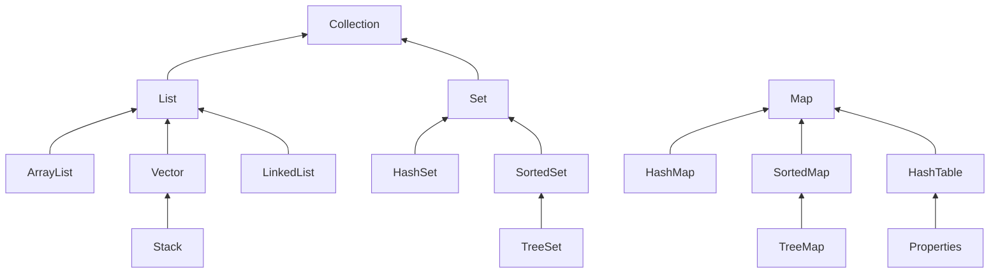
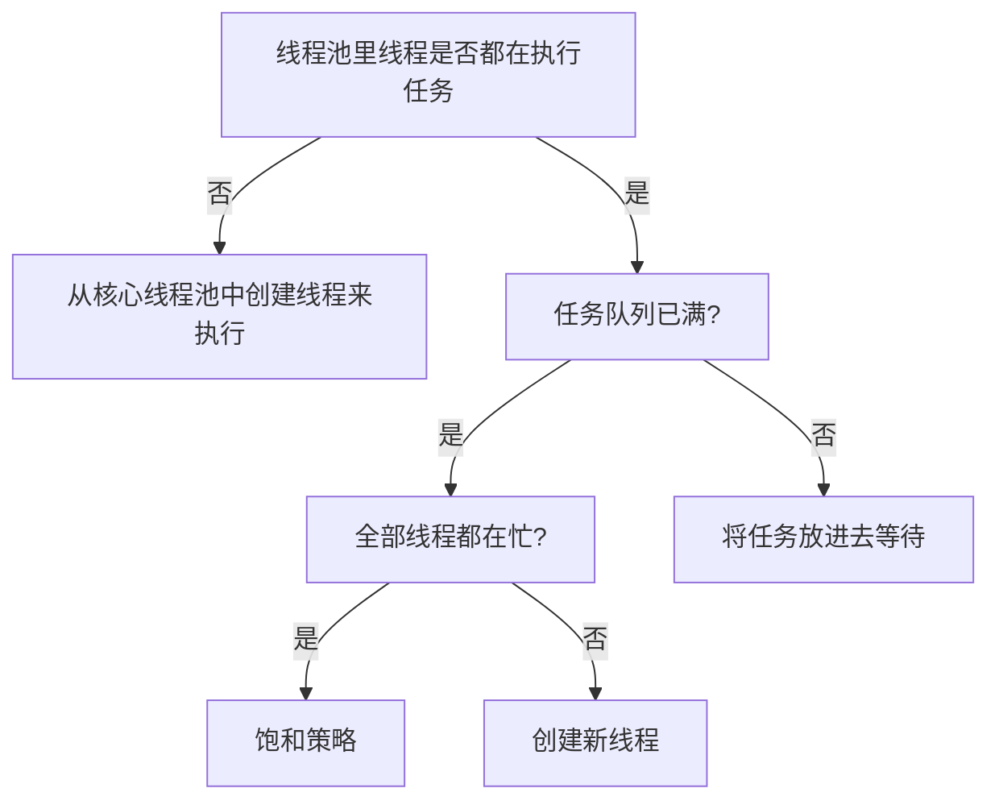

## **java基础篇**


#### 1. 多态实现

JVM方法调用指令有5个，分别是：

- invokestatic:调用静态方法
- invokespecial:调用实例构造器
- invokevirtual:调用虚方法
- invokeinterface:调用接口方法,运行时确定具体实现
- invokedynamic：运行时动态解析所引用的方法

其中Invokestatic,invokespecial用于静态绑定，invokevirtual/invokeinterface用于动态绑定

静态绑定在编译期就已经决定，这些方法的符号引用在类加载的解析阶段就会解析成直接引用．这些方法被称为非虚方法，反之便是虚方法．

虚方法调用与方法的实现相关，一种是在编译期确定，称为静态分派，比如方法重载;一种是在运行时确定，称为动态分派，比如方法覆盖．对象方法基本上都是虚方法．

注：final方法不能被覆盖，所以该方法被定义为非虚方法，但是使用invokevirtual指令调用．

多态实现：

虚拟机栈中会存放当前方法调用的栈帧，在栈帧中，存储局部变量表，操作数栈，动态链接，方法出口等信息．多态实现，就是方法调用动态分派的过程，通过栈帧的信息去找到被调用方法的具体实现．

以invokevirtual为例：

- 先从操作数栈中找到对象的实际类型class
- 找到class中被调用方法签名相同的方法，如果有权限访问则返回该方法的直接引用，如果没有权限则报错:java.lang.illegalAccessError
- 如果上步找不到相符的方法，就从下往上搜索父类，并执行第二步操作
- 如果仍然找不到相符的方法，则报错：java.lang.AbsrtactMehtodError.

#### 2.内存泄漏情况有哪些

- 静态集合类引起的内存泄漏

  - ```java
    Static Vector v = new Vector(10);
    for (int i = 1; i<100; i++)
    {
    Object o = new Object();
    v.add(o);
    o = null;
    }//
    ```

    上述代码只对对象本身进行释放，vector仍然引用该对象导致对象未被释放

- 集合里面的对象属性被修改后，调用remove()方法不起作用

  - ```java
    public static void main(String[] args)
    {
    Set<Person> set = new HashSet<Person>();
    Person p1 = new Person("唐僧","pwd1",25);
    Person p2 = new Person("孙悟空","pwd2",26);
    Person p3 = new Person("猪八戒","pwd3",27);
    set.add(p1);
    set.add(p2);
    set.add(p3);
    System.out.println("总共有:"+set.size()+" 个元素!"); //结果：总共有:3 个元素!
    p3.setAge(2); //修改p3的年龄,此时p3元素对应的hashcode值发生改变
    
    set.remove(p3); //此时remove不掉，造成内存泄漏
    
    set.add(p3); //重新添加，居然添加成功
    System.out.println("总共有:"+set.size()+" 个元素!"); //结果：总共有:4 个元素!
    }
    ```

    

- 监听器：调用一个控件的诸如addXXXListener()等方法来增加监听器，但往往在释放对象的时候却没有记住去删除这些监听器，从而增加了内存泄漏的机会

- 各种连接 ：数据库连接，网络连接，IO连接必须要显式调用close()方法将其关闭，否则GC不会回收连接所占资源

- 单例模式：如果单例对象持有外部对象的引用，那么这个外部对象将不能被jvm正常回收，导致内存泄露

  - ```java
    class A{
    public A(){
    B.getInstance().setA(this);
    }
    ....
    }
    //B类采用单例模式
    class B{
    private A a;
    private static B instance=new B();
    public B(){}
    public static B getInstance(){
    return instance;
    }
    public void setA(A a){
    this.a=a;
    }
    //getter...
    }
    ```

    B持有对类Ａ的引用，类Ａ不能被回收

#### 3.classpath,path区别

path用于系统查找可执行文件(类似于源程序javac.exe)的路径，classpath指定程序使用的类文件所在的位置

#### 4.throwable和exception，error和exception的区别


throwable事java.lang包里专门用来处理异常的类，它有两个子类Error和Exception; 

Exception用来处理程序异常，包括运行时异常(隐式异常)与非运行时异常(显示异常)。运行时异常包括除0,数组越界等，非运行时异常有文件未找到，类未找到等。异常应该被捕获。

Error用来处理程序运行环境方面的异常，比如虚拟机错误，装载错误和连接错误，这类错误不是由程序本身抛出的。用于标记严重错误，合理的程序不应该去try/catch这类错误。

Error和RuntimeException都是未检查的异常，而其他的exception是检查了的异常。已检查异常通常从可恢复的程序中抛出，并且能够从该异常中使用程序恢复。RuntimeException捕获或抛出由程序员自己决定，error不应该被捕获。

异常可以被程序处理，错误无法处理

#### 5. Collection和Collections鉴别

Collection是java.util下的接口，提供了对集合对象进行基本操作的通用接口方法.



Collections则是集合类的一个工具类/帮助类，其中提供了一系列静态方法，用于对集合中元素进行排序、搜索以及线程安全等各种操作.

#### 6.抽象类和接口的区别：

| 参数           | 抽象类                                                       | 接口                                                         |
| -------------- | ------------------------------------------------------------ | ------------------------------------------------------------ |
| 默认的方法实现 | 有                                                           | 没有                                                         |
| 成员变量       | 可以有                                                       | 不可以有普通成员变量，可以有静态成员**常量**                 |
| 实现           | 子类使用extends来继承抽象类，如果子类不是抽象类，子类需要提供抽象类所有声明方法的实现 | 子类使用implements实现接口。它需要提供接口中所有声明的方法的实现 |
| 构造器         | 可以有                                                       | 没有                                                         |
| 与普通类区别   | 除了不能实例化抽象类外，没有区别                             | 完全不同的类型                                               |
| 访问修饰符     | public、protected和default                                   | public                                                       |
| main方法       | 可以存在main方法并可以运行                                   | 没有main方法                                                 |
| 多继承         | 可以继承一个类实现多个接口                                   | 只能继承一个/多个接口                                        |
| 速度           | 比接口快                                                     | 需要时间去寻找在类中实现的方法                               |
| 添加新方法     | 可以给新方法提供默认实现而不需要改变现有代码                 | 添加新方法后必须改变实现接口的类                             |

#### 7. java反射是什么，反射机制

java反射是在运行态中，对于任意一个实体类，能够知道该累的所有属性和方法。

对于任意一个对象，都能够调用它的任意方法和属性。这种动态获取信息以及动态调用方法的功能称之为java语言的反射机制。

- 在运行时判断一个对象所属的类
- 在运行时构造一个类的对象
- 在运行时判断一个类所具有的成员变量和方法
- 在运行时调用一个对象的方法

#### 8. java类初始化顺序

父类静态成员初始化 > 父类静态代码块初始化  > 子类静态成员初始化 > 子类静态代码块初始化  >父类的代码块 > 父类的构造方法 >子类的代码块 > 子类的构造方法

#### 9.  关于内部类


#### 10.String 判等

==用来判断比较的两个对象是否是同一个对象，.equals()方法则是比较两个对象里面的内容是否相等。

#### 12.blockingqueue实现原理

blockingqueue是一个接口，java实现BlockingQueue接口的类有：

- ArrayBlockingQueue:用数组存储的有界阻塞队列
- DelayQueue：对元素进行持有直到特定延迟到期
- LinkedBlockingQueue：使用链表存储的阻塞队列
- PriorityBlockingQueue：无界并发队列，可以排序，必须实现java.lang.Comparable接口
- SynchronousQueue：只能容纳单个元素的阻塞队列

blockingQueue实现主要是定义了一个可重入锁ReentrantLock()，以及两个condition,来标识队列满/空。

#### 13.java中的乐观锁与悲观锁

悲观锁：每次拿数据时认为别人会去修改访问数据，在每次访问数据时，对数据上锁，阻塞其他访问。传统关系型数据库里的行锁，表锁，写锁等都是悲观锁。java中的synchronized和ReentrantLock等独占锁就是悲观锁思想。

乐观锁：访问数据时会乐观的认为其他访问不会对数据进行修改，所以，不上锁，但是在更新时判断在此期间是否有更新访问数据的情况，可以使用版本号＋CAS操作实现。适用于读多写少的应用场景，提高吞吐量。

#### 14.equals与hashcode的区别，存入集合时的判断过程

Hashcode目的是为了提高在散列存储结构中的查找效率，使用hash算法实现

equals是比较两个对象内容是否相等

> 若两个对象equals返回true，则hashCode有必要也返回相同的int数。
> 若两个对象equals返回false，则hashCode不一定返回不同的int数,但为不相等的对象生成不同hashCode值可以提高哈希表的性能。
> 若两个对象hashCode返回相同int数，则equals不一定返回true。
> 若两个对象hashCode返回不同int数，则equals一定返回false。
>
> 同一对象在执行期间若已经存储在集合中，则不能修改影响hashCode值的相关信息，否则会导致内存泄露问题．

#### 15. volatile有什么作用？

保证共享变量可见性

禁止指令重排序

#### 16.为什么重写equals还要重写hashcode?

hashCode比较不相等后直接判定对象不相同，提高效率。只用equals方法只能判定对象是否相等，无法确认是否是同一对象。

#### 17.java8新特性

- **Lambda表达式和函数式接口**

  它允许将函数当成参数传递给某个方法，或者把代码本身当作数据处理。

- **方法引用**:通过方法名来指向一个方法
- **默认方法**：在接口里有一个实现的方法。在接口的方法加default即可指定默认方法并实现
- **Stream API:**可以使用声明的方式处理数据库
- **Date Time API**：加强对时间与日期的处理
- **Optional类**：解决空指针异常
- **Base64编码/解码器**
- **Nashorn**:JS引擎，允许我们在jvm上运行特定的javascript应用

#### 18.为什么会有4-0.4=3.60000001的现象

在二进制系统中无法精确表示0.1

#### 19.lambda表达式优缺点

优点：精简代码，使用外部定义的局部变量更灵活

缺点：降低可读性，用途局限

#### 20.Java支持的数据类型有哪些？什么是自动拆装箱？

  **基本数据类型**：byte（1字节），short（2字节），int（4字节），long（8字节），char（2字节），boolean（不确定，取值是true/false），float（4字节），double（8字节）

**引用数据类型**：包括类，接口，数组，集合，字符串等；

**自动拆装箱：**java基本数据类型与他们对应的引用类型之间的相互转换。

#### 21.数组(Array)和列表(ArrayList)有什么区别？什么时候应该使用Array而不是ArrayList?

| -        | Array                  | ArrayList            |
| -------- | ---------------------- | -------------------- |
| 类型     | 基本类型/对象类型      | 只能存对象类型       |
| 大小     | 固定                   | 可变                 |
| 灵活性   | 差                     | 提供更多的方法和特性 |
| 适用场景 | 存储不做变动的基本数据 | 对数据进行修改，查找 |

#### 22.大O符号(big-O notation)

大O符号表示当数据结构的元素增加的时候，算法规模或者性能在最坏场景下有多好。 

  大O符号也可以用来描述其他行为，比如说内存消耗。因为集合实际上就是一种数据结构，我们一般用大O符号基于时间、性能、内存消耗来选择最好的实现。 

  大O符号可以对大量数据的性能给出一个很好的说明 

#### 23.String 和StringBuffer,StringBuilder的区别

String对象是不可变的，当对String对象进行改变时，实际上是在内存中新建了一个String对象，再指向它。

StringBuffer和StringBuilder对象是可以变的，对对象进行修改时，不会改变对象的内存地址。

StringBuffer和String是线程安全的，而StringBuilder非线程安全，单线程下，效率高于StringBuffer

#### 24.简述正则表达式及其用途

在编写处理字符串的程序时，经常会有查找符合某些复杂规则的字符串的需要。正则表达式就是用于描述这些规则的工具。换句话说，正则表达式就是记录文本规则的代码。

Java中的String类提供了支持正则表达式操作的方法 包括：matches() replaceAll() replaceFirst() split() 此外 Java中可以用Pattern类表示正则表达式对象 它提供了丰富的API进行各种正则表达式操作

#### 25.类和对象的区别

　	1,类是一个抽象的概念，它不存在于现实中的时间/空间里，类只是为所有的对象定义了抽象的属性与行为。就好像“Person（人）”这个类，它虽然可以包含很多个体，但它本身不存在于现实世界上。
　　2，对象是类的一个具体。它是一个实实在在存在的东西。
　　3，类是一个静态的概念，类本身不携带任何数据。当没有为类创建任何对象时，类本身不存在于内存空间中。
　　4，对象是一个动态的概念。每一个对象都存在着有别于其它对象的属于自己的独特的属性和行为。对象的属性可以随着它自己的行为而发生改变。

#### 26.Object类的方法

- Clone方法：实现对象浅拷贝，只有实现Cloneable接口才可以调用该方法
- getClass方法：filnal方法，获得运行时类型
- toString()方法：将对象转成字符串
- finalize方法：用于释放资源
- equals方法：判断对象是否相同
- hashCode方法：获取对象hash码
- wait方法：使当前线程等待该对象的锁
- notify方法：唤醒在该对象上等待的某个线程
- notifyAll方法：唤醒在该对象上等待的所有线程

#### 27.重载和重写
- 重写是子类对父类的允许访问的方法的实现过程进行重新编写, 返回值和形参都不能改变。即外壳不变，核心重写！
- 重载(overloading) 是在一个类里面，方法名字相同，而参数不同。返回类型可以相同也可以不同。

#### 28.双亲委派模型，以及其优势
  双亲委派模型指的是当一个类加载器收到类加载请求，它不会直接加载该类而是将该请求发送给自己的父类去执行；如果父类还存在父类加载器，则继续向上进行委派，最终达到启动类加载器； 如果父类加载器可以完成加载任务，就成功返回。否则将请求返回给子类加载器，由子类加载器尝试去加载该类。

双亲委派模型使得类加载器具有层级关系，可以避免类的重复加载；保证所有的类加载器最终得到的是同一个Object对象； 防止核心API库被篡改； 

#### 29.泛型

泛型的本质是参数化类型．例如：set接口＜T＞,T就是泛型

泛型多用于容器中，往容器中方数据，事先约定什么类型数据，放的时候会检查，不是正确的类型放入时会报错，这样可以建立安全的数据，也避免了强制类型转换

#### 30．解释extends 和super 泛型限定符-上界不存下界不取

<？ extends T>限定参数类型的上界：参数类型必须是T或T的子类型
<？ super T> 限定参数类型的下界：参数类型必须是T或T的超类型

限定通配符总是包括自己
上界类型通配符：add方法受限
下界类型通配符：get方法受限
如果你想从一个数据类型里获取数据，使用 ? extends 通配符
如果你想把对象写入一个数据结构里，使用 ? super 通配符
如果你既想存，又想取，那就别用通配符

不能同时声明泛型通配符上界和下届

> 上界<? extend Fruit> ，表示所有继承Fruit的子类，但是具体是哪个子类，无法确定，所以调用add的时候，要add什么类型，谁也不知道。但是get的时候，不管是什么子类，不管追溯多少辈，肯定有个父类是Fruit，所以，我都可以用最大的父类Fruit接着，也就是把所有的子类向上转型为Fruit。
>
> 下界<? super Apple>，表示Apple的所有父类，包括Fruit，一直可以追溯到老祖宗Object 。那么当我add的时候，我不能add Apple的父类，因为不能确定List里面存放的到底是哪个父类。但是我可以add Apple及其子类。因为不管我的子类是什么类型，它都可以向上转型为Apple及其所有的父类甚至转型为Object 。但是当我get的时候，Apple的父类这么多，我用什么接着呢，除了Object，其他的都接不住。

#### 31.是否可以在static环境中访问非static变量？

否

Static变量属于类变量，在类加载时被初始化，非static变量属于实例变量，在创建对象之后才能访问．

#### 32.通过反射创建对象

- 方法1：通过类对象调用newInstance()方法，例如：String.class.newInstance()
- 方法2：通过类对象的getConstructor()或getDeclaredConstructor()方法获得构造器（Constructor）对象并调用其newInstance()方法创建对象，例如：String.class.getConstructor(String.class).newInstance(“Hello”);

#### 33.java支持多继承吗？

不支持，java中无法继承多个类，但是可以扩展多个接口

#### 34．Comparable和Comparator接口是干什么的？列出它们的区别

二者都使用来进行集合元素比较排序的．

Comparable用于在集合内部定义方法实现的排序，Comparator是集合外部实现的排序．

Comparable接口位于 java.lang包下，Comparator接口位于java.util包下。

 Comparable:    内部比较器，一个类如果想要使用	Collections.sort(list) 方法进行排序，则需要实现该接口

Comparator:    外部比较器用于对那些没有实现Comparable接口或者对已经实现的Comparable中的排序规则不满意进行排序.无需改变类的结构，更加灵活。（策略模式）

#### 35.　面向对象的特征有哪些方面,３个特性

- 封装：实现软件部件的“高内聚、低耦合”，防止程序相互依赖性而带来的变动影响．在面向对象的编程语言中，封装就是把描述一个对象的属性和行为的代码封装在一个“模块”中，也就是一个类中．封装隐藏了类的内部实现机制，可以在不影响使用的情况下改变类的内部结构，同时也保护了数据。对外界而已它的内部细节是隐藏的，暴露给外界的只是它的访问方法。
- 继承：重用父类代码．在定义和实现一个类的时候，可以在一个已经存在的类的基础之上来进行，把这个已经存在的类所定义的内容作为自己的内容，并可以加入若干新的内容，或修改原来的方法使之更适合特殊的需要．提高了软件的可重用性和可扩展性
- 多态：程序中定义的引用变量所指向的具体类型和通过该引用变量发出的方法调用在编程时并不确定，而是在程序运行期间才确定．即一个引用变量倒底会指向哪个类的实例对象，该引用变量发出的方法调用到底是哪个类中实现的方法，必须在由程序运行期间才能决定。因为在程序运行时才确定具体的类，这样，不用修改源程序代码，就可以让引用变量绑定到各种不同的类实现上，从而导致该引用调用的具体方法随之改变，即不修改程序代码就可以改变程序运行时所绑定的具体代码，让程序可以选择多个运行状态，这就是多态性。

#### 36.final, finally, finalize的区别。

- final(关键字，修饰符):用于声明属性，方法和类，代表属性的不可变，方法的不可重写，类的不可继承
- finally(异常处理机制):用于异常处理语句结构，表示总是执行
- finalize(类中的方法名):是Object类的一个方法，在垃圾回收器回收对象的时候会调用对象的此方法，供垃圾收集时其他资源的回收，如关闭文件等

#### 37.关键字：throws,throw,try,catch,finally分别代表什么意义？在try块中可以抛出异常吗？

- try:用于监听，将被监听的代码放入try块内，当try语句块内发生异常时，抛出
- catch:捕获异常
- finally:表示总是被执行
- throw:用于抛出异常
- throws:用于声明方法可能抛出的异常

#### 38.内部类可以引用他包含类的成员吗?

可以．普通类没有限制，静态内部类只能访问其他类的静态成员

#### 39．如何通过反射获取和设置对象私有字段的值

通过类对象的getDeclaredField()方法，并设置字段对象的setAccessible(true)将其设置为可以访问．

#### 40．面向对象６大原则

- 单一职责原则：就一个类而言，应该仅有一个引起它变化的原因．类中应该是一组相关性很高的函数，数据的封装．
- 开闭原则：软件中的对象对扩展是开放的，对修改是封闭的．
- 里氏替换原则：所有引用基类的地方必须能够透明的使用其子类的对象．即：父类能出现的地方，子类也可以出现，反过来不行
- 依赖倒置原则：高层模块不依赖底层模块的细节
- 接口隔离原则：类之间的依赖关系应该建立在最小的接口上
- 最少知识原则：一个对象应该对其它对象有最少的了解

#### 41.Query接口的list方法和iterate方法有什么区别？

- list方法直接取所有字段，iterate先取ID,用的时候再根据ID获取对象
- List方法无法使用缓存，iterate可以使用缓存
- list不会引起N+1查询问题，而iterate会

#### 42.四类八种基础数据类型及其包装类，装箱拆箱

基本数据类型对应的包装类

byte 		Byte

boolean		Boolean

short		Short

int 			Integer

long		Long

float		Float

double		Double

char		Character

自动装箱就是Java自动将原始类型值转换成对应的对象，比如将int的变量转换成Integer对象，这个过程叫做装箱，反之将Integer对象转换成int类型值，这个过程叫做拆箱

包装类都是final类，不可变

> Integer a=new Integer(5);
>
> a=6; //不是将Integer对象值改成6，而是新建了一个对象，将a指向新对象	

#### 43.String类可以继承吗，final说说，final修饰StringBuffer还可以append吗

String类不可继承，因为String类被final关键字修饰

final关键字：final表示不可变的意思．修饰类，代表类的不可继承；修饰方法，方法不可重写；修饰变量，变量不可变

final修饰的StringBuffer仍然可以继续添加元素．因为final修饰StringBuffer对象，代表引用对象不可变，append方法并没有产生新的对象，所以可以继续append.

#### 44.工厂方法与抽象工厂

工厂方法：一个抽象产品类，可以派生出多个具体产品类

抽象工厂：多个抽象产品类，每个抽象产品类可以派生出多个具体产品类

区别：

工厂方法模式只有一个抽象产品类，抽象工厂模式有多个

工厂方法模式： 只有一个抽象产品类，具体工厂类只能创建一个具体产品类的实例 
抽象工厂模式：   有多个抽象产品类 ，具体工厂类能创建多个具体产品类的实例

#### 45.面向对象和面向过程区别

面向过程就是分析出解决问题所需要的步骤，用函数将步骤一步步实现，使用的时候一次调用

面向对象就是把构成问题事务分解成各个对象，建立对象的目的不是完成一个个步骤，而是描述某个事务在解决问题的步骤中的行为．

面向对象技术：以对象为基础，以事件或消息来驱动对象执行处理的程序设计技术．具有封装，继承和多态性．

区别：

- 面向过程使用函数来描述对数据操作，将数据与操作分离；面向对象将数据与对数据的操作封装在一起．
- 面向过程以功能为中心来设计功能模块，难于维护；面向对象以数据为中心来描述系统，易于维护
- 面向过程的控制流程由函数执行顺序决定；面向对象控制流程由运行时实际事件来触发，符合实际需要
- 面向对象可以利用框架产品进行编程．

#### 46．volatile和synchronized的区别 

- volatile本质是告诉当前变量副本是不确定的，需要从主存中读取，synchronized则是锁定当前变量，只有当前线程可以访问，其他线程阻塞
- 范围：volatile作用于变量，synchronized则可以修饰类，方法，代码块，变量
- volatile不具有原子性而synchronized具有
- volatile标记的变量不会被编译器优化，而synchronized标记的变量可以被编译器优化

#### 47.调用对象的wait方法为什么需要先加锁 

java中所有对象都能够被作为监视器：指一个拥有一个独占锁，一个入口队列和一个等待队列的实体entity.

只有线程拥有某个对象的独占锁时，才能够调用该对象的wait(),notify()方法．调用wait方法会强制当前线程释放对象锁．这意味着当前线程已经获取到了该对象的锁．因此，线程必须在某个对象的同步方法或者同步代码块中才能调用该对象的wait()方法．

当某线程调用该对象的notify()/notifyAll()方法时，任意一个处于该对象等待队列的线程，将被转移到该对象的入口队列，接着这些线程将竞争该对象的锁．如果没有线程在该对象的等待队列，notify方法不起作用．调用对象的notify()方法之前，线程需要获取该对象的锁．

#### 48.run方法和start方法的区别

start方法可以启动线程，而run方法只是Thread类中的一个普通方法调用，它需要在主线程里执行

#### 49.关于扩容

**ArrayList** 初始容量10，采用延迟初始化策略。动态扩容，扩容后容量为原容量1.5倍

Vector 初始容量10,扩容时容量增加一倍。

HashMap 初始容量16，扩容时增加一倍

HashSet 初始容量16，扩容时容量增加一倍

HashTable 初始容量11，扩容时容量为原来2倍+1

#### 50.反射是什么

java反射指，对于任意一个类，能够知道该类的所有属性和方法。对于任意一个对象，能够调用它的任意方法和属性。这种动态获取信息以及动态调用对象的功能就是java的发射机制

#### 51. Java的堆和栈区别

- 堆主要是用内存储java中的对象，而栈主要是用来存储局部变量和方法调用
- 独有性：栈内存属于线程私有，而堆内存对所有线程可见，属于共享内存。
- 异常：栈中如果没有可用空间供分配，会抛出java.lang.stackOverFlowError.堆如果没有可用内存供分配，会出现java,lang.outofMemoryError异常。
- 空间：栈空间大小是小于堆空间的，如果在栈内使用递归，容易出现栈溢出。使用-Xss设置栈大小，-Xms设置堆大小
- 栈内数据更新速度大于堆，堆使用垃圾回收机制来释放无用变量

#### 52.深拷贝和浅拷贝

**浅拷贝**：指拷贝对象时仅仅拷贝对象本身(包括对象中的基本变量)，而不考虑拷贝对象包含的引用指向的对象。

**深拷贝**：拷贝对象包含的引用所指向的所有对象。

clone()方法默认得到对象的浅拷贝。需要对对象的clone()方法重写以实现深拷贝。

### 集合

#### 1. java集合的类层次关系，各种集合容器简单描述


ArrayList: 使用数组实现，适合随机访存

LinkedList:使用链表实现，适合插入删除

HashSet:不保证元素有序，非同步，集合中可包含null

TreeSet: 集合内元素有序，默认使用自然排序，通过compareto()方法进行两个元素的比较

HashMap:非线程安全，基于数组与链表实现

TreeMap:非线程安全，基于红黑数实现，保证有序

#### 1.如果hashMap的key是一个自定义的类，怎么办

必须重写HashCode和equals方法．

由于hashCode方法继承于Object类，其hashCode默认使用内存地址，这样即便两个相同含义的对象，比较也是不相等的．如果两个相等的对象，使用地址比较的话，肯定不相等．equals方法默认是比较两个对象是否是同一对象，所以该方法也要重写．

#### 1.任何自定义类都可以放入hashmap吗？有什么要求，如何实现？

可以，需要重写equals()方法和hashcode方法。在使用的时候需要强制转换？

#### 2.ArrayList和LinkedList的区别，如果一直在list的尾部添加元素，用哪个效率高？

ArrayList底层数据结构是动态数组，容量可以动态增长．ArrayList可以允许Null元素，

LinkList基于链表实现，允许包括null在内的元素．

两端进行数据操作的话，linkList效率高

#### 3.concurrenthashmap有啥优势，1.7，1.8区别？

1.7中concurrenthashmap使用Segment+HashEntry实现，在计算size的时候先不加锁计算两次，如果相同则返回，否则加锁计算元素个数

1.8采取的是Node+CAS+Synchronized来保证并发安全

#### 4.ArrayList是否会越界

会，由于ArrayList非线程安全，多线程并发add时会出现越界问题

#### 5.为什么集合类没有实现Cloneable和Serializable接口？

克隆(cloning)或者是序列化(serialization)的语义和含义是跟具体的实现相关的。因此，应该由集合类的具体实现来决定如何被克隆或者是序列化。

#### 6.什么是迭代器

迭代器是一种设计模式，它是一个对象，它可以遍历并选择序列中的对象，而开发人员不需要了解该序列的底层结构。迭代器通常被称为&ldquo;轻量级&rdquo;对象，因为创建它的代价小。

#### 7.Iterator和ListIterator的区别是什么？

- iterator可以用来遍历Set和List集合，ListIterator只能遍历List
- Iter对集合只能向前遍历，ListIterator既可以向前，又可以向后遍历
- ListIterator实现了Iterator接口，并包含其他功能：增加元素，替换元素，获取前一个元素/后一个元素等．

#### 8.快速失败(fail-fast)和安全失败(fail-safe)的区别是什么？

快速失败(fail-fast)

​	迭代器遍历集合时，如果在遍历过程对集合对象进行了修改，则会抛出Concurrent Modification Exception

原理：迭代器在遍历的时候直接访问集合中的内容．并在遍历过程中使用一个modCount变量．集合在遍历期间如果内容发生了变化，modCount值会改变．每当迭代器使用hasNext()/Next()遍历下一个元素之前，都会检测modCount是否为expectedmodCount值，符合就继续遍历，否则抛出异常(此情况不一定会发生)

java.util包下的集合类都是快速失败的，不能在多线程下发生并发修改

安全失败(fail-safe)

采用安全失败机制的集合容器，遍历时不是直接在集合内容上进行访问，而是拷贝访问．此时在迭代器对集合遍历过程中集合元素发生修改不会被迭代器检测到，所以就不会触发Concurrent Modification Exception

缺点：迭代器遍历的集合是在遍历开始时那一刻，拷贝集合所有元素进行遍历，所以在这期间，集合元素发生变化，迭代器是无法感知的．

java.util.concurrent包下的容器都是安全失败，可以在多线程下并发使用．

#### 9.ArrayList,Vector,LinkedList的存储性能和特性是什么？

    ArrayList 采用的是数组形式来保存对象的，这种方式将对象放在连续的位置中，所以最大的缺点就是插入删除时非常麻烦
    
    LinkedList 采用的将对象存放在独立的空间中，而且在每个空间中还保存下一个链接的索引 但是缺点就是查找非常麻烦 要丛第一个索引开始
    
    ArrayList和Vector都是用数组方式存储数据,此数组元素数要大于实际的存储空间以便进行元素增加和插入操作,他们都允许直接用序号索引元素,但是插入数据元素涉及到元素移动等内存操作,所以索引数据快而插入数据慢.
    
    Vector使用了sychronized方法(线程安全),所以在性能上比ArrayList要差些.
    
    LinkedList使用双向链表方式存储数据,按序号索引数据需要前向或后向遍历数据，所以索引数据慢,是插入数据时只需要记录前后项即可,所以插入的速度快.
arraylist和vector的区别?
1).同步性:Vector是线程安全的，也就是说是同步的，而ArrayList是线程不安全的，不是同步的
2).数据增长:当需要增长时,Vector默认增长为原来一培，而ArrayList却是原来的一半

#### 10. HashMap,HashTable,ConcurrentHashMap区别，底层源码

​	**HashMap**:

- 底层数组＋链表实现，可以存储null键和null值，将key为null的值存储在table[0]的位置，**非线程安全**

- 初始size=16,扩容：newsize＝２×oldsize，每次扩容时，重新计算所有元素位置并插入.默认触发扩容条件为键值对达到数组大小的75%。

- 1.7 扩容逻辑判断是在插入操作之后，可能出现无效扩容(扩容后，没有数据再次插入)

- 1.7 通过**链表法**解决冲突，遇到冲突时，会去找到对应位置的entry链，依次比较链上的每一个元素equals()方法．

  **HashTable**:

- 底层数组＋链表，key和value都不能为null,**线程安全**，实现安全方式是修改数据时锁住整个hashTable,效率低

- 初始size＝11，newsize=oldsize*2+1

  **ConcurrentHashMap**

- 底层采用分段的数组＋链表实现，**线程安全**

- 通过把整个map分割成Ｎ个Segment,可以提供相同的线程安全，效率提升Ｎ倍

- 某些方法需要跨段，比如size(),containsValue(),实现时需要获取所有的段锁，操作完毕后顺序释放所有段的锁

- 扩容：段内扩容，在插入前检测是否需要扩容以避免无效扩容

- ConcurrentHashMap不允许Key和Value为null

> 1.8 HashMap基于哈希思想，实现对数据的读写。当我们将键值对传递给put()方法时，它调用键对象的hashCode()方法来计算hashcode，然后找到bucket位置来存储值对象。当获取对象时，通过键对象的equals()方法找到正确的键值对，然后返回值对象。HashMap使用链表来解决碰撞问题，当发生碰撞时，对象将会储存在链表的下一个节点中。HashMap在每个链表节点中储存键值对对象。当两个不同的键对象的hashcode相同时，它们会储存在同一个bucket位置的链表中，可通过键对象的equals()方法来找到键值对。如果链表大小超过阈值（TREEIFY_THRESHOLD,8），链表就会被改造为树形结构。
>
> 在HashMap中，null可以作为键，这样的键只有一个，但可以有一个或多个键所对应的值为null。**当get()方法返回null值时，即可以表示HashMap中没有该key，也可以表示该key所对应的value为null**。因此，在HashMap中不能由get()方法来判断HashMap中是否存在某个key，应该用**containsKey()**方法来判断。而在Hashtable中，无论是key还是value都不能为null。
>
> Hashtable是线程安全的，它的方法是同步的，可以直接用在多线程环境中。而HashMap则不是线程安全的，在多线程环境中，需要手动实现同步机制。
>
> Hashtable与HashMap另一个区别是HashMap的迭代器（Iterator）是fail-fast迭代器，而Hashtable的enumerator迭代器不是fail-fast的。所以当有其它线程改变了HashMap的结构（增加或者移除元素），将会抛出ConcurrentModificationException，但迭代器本身的remove()方法移除元素则不会抛出ConcurrentModificationException异常。但这并不是一个一定发生的行为，要看JVM。

#### 11. 讲一下java.util.concurrent包下的类

- **ConcorrentHashMap 分段锁**

> HashMap:HashMap非线程安全，在并发环境下可能会形成**环状链表**(在扩容时，hashmap使用链表法解决冲突，此时a -> b -> null，线程A扩容到a时阻塞，线程B继续扩容，并使用头插法，扩容后b -> a->null，此时A继续扩容，将a的next指向b形成环)，所以在并发环境中使用HashMap很危险
>
> HashTable:与HashMap实现原理几乎一样，不过区别在于HashTable不允许key和value为null；HashTable线程安全。代价高昂

ConcorrentHashMap将数据分成一段一段(segment)存储，每段加一把锁(可重入锁ReentrantLock)

- **CopyOnWriteArrayList**

适用于读多写少并发场景，线程安全的写时复制(在写时内存会同驻两个对象，旧对象和新对象，此时读取数据会读到旧数据)

存在两个问题：内存占用问题和数据一致性问题

- **ReentrantLock 可重入锁**

效果和synchronized一样,可以同步执行

- **BlockingQueue 阻塞队列(接口)**

用于一个线程生产对象，另一个线程消费对象的场景，无法向队列插入null

- **CyclicBarrier 循环栅栏**

用于同步线程，它允许一组线程到达某个栅栏点相互等待，发生阻塞，等到所有线程都到达时，该组线程才会继续执行。

- **Semaphore 信号量**

负责协调各线程，控制某个资源可被同时访问的个数。

#### 12.treeMap了解吗

TreeMap是一个有序的key-value集合，通过红黑树实现。

继承AbstractMap，所以它是一个Map

实现NavigableMap接口，支持一系列导航方法，比如返回有序key集合；

实现Cloneable接口，可以被克隆

实现Serializable接口，可以被序列化

非同步

#### 12.hashmap的线程安全怎么实现？插入数据时候一定上锁吗？获取concurrenthashmap的size

**java7:**

concurrenthashmap,通过将数据分层多个段，每段存储部分数据，然后对每一段数据分别配一把锁，留在多线线程竞争访问时，如果线程操作的数据定位到段不一致，线程之间可以并行访问而不发生冲突。

concurrenthashmap在put时上锁，锁为可重入锁(ReentrantLock).执行put操作时，先进行一次hash定位segment位置获取分段锁，然后进行第二次hash定位hashEntry位置。

获取size时，先不加锁，计算３次size，如果前后一致，则认为当前没有元素加入，计算结果是准确的(每一个segment里有一个全局count保存段里数据个数)。如果前后两次计算结果不一致，那么就会给每段segment加锁，计算size后返回。

**java8**:

concurrenthashmap摒弃了分段锁的概念，通过CAS+Synchronized来保证并发更新的安全，底层采用数组+链表+红黑树的存储结构。

java1.8中：使用一个volatile变量baseCount记录元素个数，当插入新书据或者删除数据时，通过baseCount和counterCell进行ＣＡＳ计算，最终累加baseCount（baseCount在put操作后会进行cas操作自增１，如果失败会去增加counterCell）和CounterCell数组得到size.

#### 13.hashset和hashmap的区别，写代码使用hashmap实现一个简单的hashset

| HashMap                                                | HashSet                        |
| ------------------------------------------------------ | ------------------------------ |
| 实现Map接口                                            | 实现Set接口                    |
| 用于存储键值对                                         | 用于存储对象                   |
| 不允许重复键，允许重复值，允许单个null键和任意数量空值 | 不允许重复元素，允许null值存入 |

```java
class HashSet<E>extends AbstractSet<E> implements Set<E>{
    private Hash<E,Object>map;
    public HashSet(){
        map=new　HashMap<>();
    }
    public HashSet(int initialCapacity, float loadFactor) {
        map=new HashMap<>(initialCapacity,loadFactor);
    }
    public HashSet(int initialCapacity){
        map=new HashMap<>(initialCapacity);
    }
    public boolean add(E e){
        return map.put(e,null)==null;
    }
    public boolean remove(Object o){
        return map.remove(0)==null;
    }
    
    public int size(){
        return map.size();
    }
    public contains(Object o){
        return map.containsKey(o);
    }
    pubic isEmpty(){
        return map.isEmpty();
    }
}
```

#### 14.Java容器整体框架

Java容器主要分为５部分，List列表，Set集合，Map映射，队列，工具类(Iterator迭代器，Enumeration枚举类，Arrays和Collections)

- List以线性方式存储元素，集合中可以存放重复对象，元素有序
  - ArrayList:随机访问元素快，增删元素慢，非线程安全
  - Vector:与ArrayList类似，线程安全．
  - LinkedList:随机访问元素慢，增删元素快．
  - Stack:栈，继承Vector,特点先进后出
- Set:不保存重复元素，Set内元素不保证有序
  - HashSet:随机查找快，底层使用HashMap实现
  - TreeSet:Set内元素有序，底层为树结构
  - LinkedHashSet:使用链表维护元素顺序，使用迭代器遍历Set时，结果会按照元素插入次序显示
- Queue:特殊线性表，先进先出
- Map:一种把键对象和值对象映射的集合，Map没有继承Collection接口
  - HashMap
  - HashTable:底层实现与HashMap一致，只不过使用synchronized保证线程安全
  - TreeMap:基于红黑树实现
- 工具类
  - iterator:迭代器．单向移动
  - ListIterator:只用于List类访问，可以双向移动
  - Emueration:枚举类
  - Arrays:方便地操作数组，方法都是静态方法
  - Collections:

#### 15.说一下map的分类和常见的情况

java为数据结构中的映射定义了一个接口java.util.Map;

它有四个实现类,分别是HashMap Hashtable LinkedHashMap 和TreeMap.  

Map主要用于存储健值对，根据键得到值，因此不允许键重复(重复了覆盖了),但允许值重复。  

- Hashmap 是一个最常用的Map,它根据键的HashCode值存储数据,根据键可以直接获取它的值，具有很快的访问速度，遍历时，取得数据的顺序是完全随机的。

  HashMap最多只允许一条记录的键为Null;允许多条记录的值为 Null;

  HashMap不支持线程的同步，即任一时刻可以有多个线程同时写HashMap;可能会导致数据的不一致。

- Hashtable与 HashMap类似,它继承自Dictionary类，不同的是:它不允许记录的键或者值为空;它支持线程的同步，即任一时刻只有一个线程能写Hashtable,因此也导致了 Hashtable在写入时会比较慢。  

- LinkedHashMap 是HashMap的一个子类，保存了记录的插入顺序，在用Iterator遍历LinkedHashMap时，先得到的记录肯定是先插入的.也可以在构造时用带参数，按照应用次数排序。在遍历的时候会比HashMap慢，不过有种情况例外，当HashMap容量很大，实际数据较少时，遍历起来可能会比 LinkedHashMap慢，因为LinkedHashMap的遍历速度只和实际数据有关，和容量无关，而HashMap的遍历速度和他的容量有关。  

- TreeMap实现SortMap接口，能够把它保存的记录根据键排序,默认是按键值的升序排序，也可以指定排序的比较器，当用Iterator 遍历TreeMap时，得到的记录是排过序的。  


#### 16.关于延迟初始化

ConcurrentHashMap

1.7初始化时，只会对一个Segment进行初始化，其他Segment会采用延迟初始化机制

1.8初始化也是延迟初始化策略，在第一次put时进行初始化，并且只会初始化一次

### 线程

#### 1.多线程中的i++线程安全吗？为什么？

不安全，由于i++不是原子操作．分为读取i值，对i值＋１，赋值给i．执行任何一步都是可能被其他线程抢占．

#### 2.多线程同步方法

- 使用synchronized关键字
- wait和notify:wait使一个线程处于等待状态，并释放所持对象的lock;notify()唤醒一个处在等待状态的线程
- 使用volatile变量：
- 使用可重入锁ReentrantLock
- 使用阻塞队列BlockingQueue
- ThreadLocal

#### 3.线程池运行流程，参数，策略



#### 4.AQS队列同步器

AQS的实现依赖内部的同步队列(FIFO双向队列)，如果当前线程获取同步状态失败，AQS会将该线程以及等待状态信息构造成一个Node,将其加入同步队列的尾部，同时阻塞当前线程，当同步队列释放时，唤醒队列的头节点．

ReentrantLock,CountdowLatch就是基于AQS实现．

它维护一个 volatile int state状态和一个FIFO线程等待队列．

#### 5.创建线程的方法，哪个更好，为什么？

Java中创建线程主要有两种方式 

- 继承Thread类
- 实现Runnable接口 

后者更好，Runnable可以避免继承的局限，一个类可以继承多个接口；适合资源共享

#### 6.Java中的线程池

线程池是一种多线程处理形式，处理过程中将任务添加队列，然后在创建线程之后自动启动这些任务．

参数：

- corePoolSize:线程池大小
- maximunPoolSize:线程池中创建的最大线程数
- keepAliveTime:空闲线程多久时间后被销毁

类型：

- **FixedThreadPool**:线程池中的线程个数固定
- **CachedThreadPool**:创建该线程池对象时，线程池初始为空．使用execute/submit方法向线程池提交任务时，会自动创建线程．如果线程池中有空余线程，则不会新建．线程空余60s后被回收
- **SingleThreadPool**:单线程的线程池
- **ScheduledThreadPool**：支持定时以及周期性任务的执行

#### 7.线程池有什么好处

- 重用线程，减少线程创建与销毁的开销
- 控制线程池的最大并发数，避免大量线程间抢占资源引起阻塞
- 管理线程

#### 8.CyclicBarrier和CountDownLatch区别

- CyclicBarrier的某个线程运行到某个点后停止运行，直到所有线程都达到同一个点，所有线程才会重新运行,CountDownLatch线程运行到某一个点后计数值-1,该线程继续运行直到计数值为０停止运行
- CyclicBarrier只能唤醒一个任务，CountDownLatch可以唤醒多个任务
- CyclicBarier可以重用，CountDownLatch不可重用，当计数值为0时，CountDownLatch不可用

#### ９.同步方法和同步代码块

同步方法：

由于java的每一个对象都有一个内置锁，当用此关键字修饰方法时，内置锁会保护整个方法．在调用方法前，要获取内置锁，否则处于阻塞状态

同步代码块

即有synchronized修饰符修饰的语句块，被该关键词修饰的语句块，加上内置锁，实现同步．

同步方法默认使用this或者当前class对象作为锁．

同步代码块可以选择以什么来加锁，比同步方法更颗粒化．

#### 10.sleep和wait的区别

|            | wait                                                         | sleep                                             |
| ---------- | ------------------------------------------------------------ | ------------------------------------------------- |
| 同步       | 只能同步上下文中调用wait方法，否则抛出IllegalMonitorStateException异常 | 不需要在同步方法或同步块中调用                    |
| 作用对象   | wait方法定义在object类中，作用域对象本身                     | sleep方法定义在java.lang.Thread中，作用于当前线程 |
| 是否锁资源 | 是                                                           | 否                                                |
| 唤醒条件   | 其他线程调用对象的notify()/notifyAll()方法                   | 超时或者调用interrupt方法                         |
| 方法属性   | 实例方法                                                     | 静态方法                                          |

Sleep()方法是线程主动让出CPU,在sleep指定时间后，Cpu再回到该线程继续往下执行，所以，该方法不会释放同步资源锁．

Wait()方法指当前线程自己暂时释放同步资源锁，让其他等待该资源的线程得以执行，只有调用notify方法才能唤醒该线程．

这两个方法来自不同的类，分别是Thread和Object

最主要的是sleep方法没有释放锁，而wait方法会释放锁，所以wait方法在释放前必须获取同步块或者同步方法的锁。

sleep必须捕获异常，wait/notify/notyfyAll不需要捕获异常


#### 11.Java AIO、NIO、BIO(不太理解)

- 同步阻塞IO(JAVA BIO):同步并阻塞，服务器实现模式为一个连接一个线程，客户端有链接请求时服务器启动一个线程进行处理．可以通过线程池机制来进行改善．
- 同步非阻塞IO(Java New IO)：同步非阻塞，服务器实现模式为一个请求一个线程，即客户端发送的连接请求都会注册到多路复用器上，多路复用器轮询到连接有IO请求时才会启动一个线程进行处理．用户进程也需要不断询问IO操作是否就绪．NIO包含以下几个核心组件：Channel(通道),Buffer(缓冲区),Selector(选择器)　　　原生NIO的缺点：
  - JDK的NIO底层由epoll实现，会存在空轮询bug导致cpu占用飙升到100%
  - NIO容易出现各类bug，项目维护成本较高
- 异步非阻塞IO(Java AIO):也就是NIO2,在java7中引入了NIO改进版NIO2,异步非阻塞IO模型．在此种模式下，用户进程发起一个IO操作后立即返回，等IO操作完成后，应用程序会大得IO操作完成的通知，用户进程只需要对数据进行处理，而不需要实际的IO读写操作．读写操作由内核完成．

NIO与BIO区别：

- IO流是阻塞地，NIO流是不阻塞的．单线程从通道读取数据到buffer同时可以继续干其他事，写数据也一样．
- IO是面向流，NIO面向缓冲区
- NIO通过通道进行读写，通道是双向的，而IO的流是单向的
- Selectors:NIO有选择器，而IO没有．选择其可以使单线程处理多个通道．可以提高系统效率

**适用场景**

- BIO适用于连接数目较小且固定的架构，该方式对服务器资源要求较高，程序直观简单易于理解
- NIO适用于连接数目较多且连接比较短的架构，如聊天服务器．
- AIO适用于连接数目多连接比较长的结构．

#### 12．ThreadLocal原理

ThreadLocal 适用于场景：

- 每个线程需要有自己单独的实例
- 实例需要在多个方法中共享，但不希望被多线程共享

总结：

- ThreadLocal并不解决线程间共享数据的问题
- Thread通过隐式的在不同的线程内部创建独立的实例副本避免了实例线程安全的问题
- 每个线程持有一个TheadLocalMap维护了ThreadLocal对象与具体实例的映射，该Map由于只被持有它的线程访问，故不存在线程安全问题以及锁问题
- ThreadMap中Entry为弱引用，故不存在ThreadlLocal对象无法回收问题
- ThreadLocal的set方法通过调用replaceStaleEntry方法回收键为null的Entry对象的值以及Entry对象本身从而防止内存泄漏
- ThreadLocal适用于变量在线程间隔离且在方法间共享的场景

**实现原理**

早期的ThreadLocal类内部有一个线程安全的Map,然后使用线程ID作为Map的key,实例对象作为value,这样可以达到各个线程的值隔离的效果。

现在的ThreadLocal实现是另一种方式：

Get方法：

- 调用Thread.currentThread()获取当前线程对象t; 
- 根据当前线程对象，调用getMap(Thread)获取线程对应的ThreadLocalMap对象(每一个Thread类中，包含一个线程私有变量ThreadLocalMap,即就是ThreadLocal类中的静态内部类)
- 如果map不为空，则在map中以当前线程的ThreadLocal作为key获取map中对应的value,如果value不为空，则返回该value
- 如果map为空，则调用setInitialValue()方法，对线程的ThreadLocalMap对象进行初始化操作，Key为ThreadLocal对象，value为initialValue()方法返回值，也就是null

**这样的设计具有以下优点**：

- 每个Map中Entry节点数量变少了：之前是Thread的数量，现在是ThreadLocal的数量，提高性能
- 到Thread销毁后对应的ThreadLocalMap也被回收，提高内存使用率

**其他**

ThreadLocal中静态内部类ThreadLocalMap与HashMap类似，map中每个元素为Entry类型对象，Entry继承自WeakReference，这样每个key是一个弱引用(Key是ThreadLocal对象)

#### 13.一个线程怎么判断自己是否可以获得共享资源的锁？

答一个线程在获取共享资源前会判断markword里存放的是不是自己的threadid如果是则该线程处于偏向锁，可重入。若不是，则使用CAS进行切换，锁升级为轻量级锁，偏向锁释放，清空mark word,两个线程开始竞争，成功的将自己的markword存入对应的threadid，失败的开始自旋。 

#### 14.java多线程的实现方式

- 继承Thread类

  - ```java
    public class MyThread extends Thread{
        public void run(){
            System.out.println("hello");
        }
        MyThread my1=new Thread();
        MyThread my2=new　Thread();
        my1.start();
        my2.start();
    }
    ```

- 实现Runnable接口

  - ```java
    public class MyThread implements Runnable{
        public void run(){
            System.out.println("Hello");
        }
    }
    MyThread t1=new MyThread();
    Thread th=new Thread(t1);
    th.start();
    ```

- 实现Callable接口通过FutureTask包装器来创建Thread线程

  ```java
  import java.util.concurrent.Callable;
  import java.util.concurrent.ExecutionExceptoin;
  import java.util.concurrent.FutureTask;
  
  public class MyThread implements Callable<String>{
      private int count = 20;
      public String call() throws Exception{
          for(int i=count;i>0;i++){
              System.out.println(Thread.currentThread().getName()+" "+i);
          }
          return "sale out";
      }
      public static void main(String[] args){
          Callable<String> callable =new MyThread();
          FutureTask<String> futureTask=new FutureTask<>(callable);
          Thread mThread=new Thread(futureTask);
          Thread mThread2=new Thread(futureTask);
          Thread mThread3=new Thread(futureTask);
          mThread.start();
          mThread2.start();
          mThread3.start();
      }
  }
  ```

  

- 使用ExecutorService、Callable、Future实现有返回结果的多线程

### 锁

#### 1.非公平锁和公平锁在ReentrantLock里的实现过程

- 非公平锁：当线程争夺锁的过程中，会先进行一次CAS尝试获取锁，若失败，则进入acquire(1)函数，进行一次tryAcquire再次尝试获取锁，若再次失败，就通过addWaiter将当前线程封装成node节点加入到Sync队列，这个时候线程只能乖乖等前面的线程执行完再轮到自己
- 公平锁：线程在获取锁的时候，会先判断Sync队列中是否有在等待获取资源的过程．若没有，则尝试获取锁;否则，通过addWaiter将当前线程封装成node节点加入到Sync队列中

#### 2.讲一下synchronized，可重入怎么实现。

通过对象监视器实现．对象的对象头有一个区域记录锁信息，包括持有锁的线程，锁计数器，锁状态信息．线程在尝试获取锁时，先看计数器是不是为0，是则直接获取锁．计数器+1，并记录持有锁的线程，当再有请求同步方法时，查看该线程是否是当前线程，如果是，则锁计数器+1，否则阻塞．当线程退出同步块时，锁计数器-1,当计数器为０时，释放锁．

#### 3.简述synchronized和java.util.concurrent.locks.Lock的异同？ 

相同点：Lock能完成Synchronized所实现的所有功能

不同点：Lock有比synchronized更精确的线程语义和更好的性能．Synchronized会自动释放锁，而Lock要求主动释放，并且必须在finally语句块内释放，Lock还有更强大的功能，比如它的tryLock可以以非阻塞的方式获取锁 

#### 5.介绍一下Syncronized锁，如果用这个关键字修饰一个静态方法，锁住了什么？如果修饰成员方法，锁住了什么？

Synchronized是一个对象锁

**对于普通的同步方法：** 
 锁是当前的对象 
 **对于静态函数的同步方法：** 
 锁是指引用当前类的class对象 
 **对于同步方法块的内容：** 
 锁是指Synchonized括号里配置的对象 ，例如：synchronized(this){}指的是当前对象

#### 6.Syncronized和lock

总结来说，Lock和synchronized有以下几点不同：

　　1）Lock是一个接口，而synchronized是Java中的关键字，synchronized是内置的语言实现；

　　2）synchronized在发生异常时，会自动释放线程占有的锁，因此不会导致死锁现象发生；而Lock在发生异常时，如果没有主动通过unLock()去释放锁，则很可能造成死锁现象，因此使用Lock时需要在finally块中释放锁；

　　3）Lock可以让等待锁的线程响应中断，而synchronized却不行，使用synchronized时，等待的线程会一直等待下去，不能够响应中断；

　　4）通过Lock可以知道有没有成功获取锁，而synchronized却无法办到。

　　5）Lock可以提高多个线程进行读操作的效率。

　　在性能上来说，如果竞争资源不激烈，两者的性能是差不多的，而当竞争资源非常激烈时（即有大量线程同时竞争），此时Lock的性能要远远优于synchronized。所以说，在具体使用时要根据适当情况选择。	

#### 7. AQS的框架中，自定义同步器使用哪些方法，分别表示什么含义？

答isheldexclusively,该线程是否独占资源。tryacquire尝试获取资源tryrelease尝试释放资源这两种是独占方式，tryacquireshared,tryreleaseshared同前两种，不过是共享方式。 

#### 8. 共享资源state何时增加何时减少？

答获得锁加一，释放减一。synchronized的state只能为1或者0，lock锁的state可以一直增加，但是增加多少就要减少多少直到为0锁释放。（可重入锁） 

#### 9. 项目中有没有使用过并发编程？用过哪些锁？

答用过synchronized和lock。他们的区别是什么？答Synchronized底层用mutex实现。在软件层面依赖Jvm，Lock底层基于AQS实现，在硬件层面依赖特殊的CPU指令（CAS）。简单介绍下CAS。Balabalabala。问CAS使用中存在什么问题？答ABA问题，怎么解决？说了版本号方式，atomicstampedreference和pause。还答了自旋时间过长消耗CPU资源。 

#### 10. Synchronized和ReentrantLock的区别

共同点：

- 协调多线程对共享变量，对象的访问
- 可重入，同一线程可以多次获得同一个锁
- 保证可见性与互斥性

不同点;

- ReentrantLock显示获得、释放锁，synchronized隐式获得释放锁
- Re可以相应中断，可轮回，syn不能相应中断
- Re是api级别的，syn是JVM级别的
- Re可以实现公平锁
- 底层实现不一样，syn是同步阻塞，使用悲观并发策略，Re同步非阻塞，乐观并发策略

#### 

## java虚拟机篇

#### 1.java类加载过程

类加载分为５步，加载、链接(验证，准备，解析)，初始化

- 加载：把class字节码文件通过类加载器装入内存
- 验证：对加载的字节流进行验证，保证其符合虚拟机规范，不会造成安全错误
- 准备：为类变量分配内存，赋予初值
- 解析：虚拟机将常量池内的符号引用替换为直接引用的过程
- 初始化：对类变量的初始化。是执行类构造器的过程，只对static修饰的变量或者语句进行初始化。

#### 2.JVM分区(JVM内存模型)

- **程序计数器**：当前线程所执行的字节码行号指示器，线程私有．如果当前jvm执行的是Native代码，程序计数器为空
- **java虚拟机栈**：存放栈帧的地方．每个线程都有自己的JAVA虚拟机栈．存有方法的局部变量表，操作数栈，动态链接，方法出口等信息
- **本地方法栈**：类似与虚拟机栈，只不过执行的是Native方法服务．
- (上面是线程私有，下面是共享内存区域)
- **堆**：存放对象实例的地方,又分为新生代/老年代
- **方法区**：存放被虚拟机加载的类信息，常量，静态变量，即时编译后的代码等数据

#### 3.GC机制讲一讲

java虚拟机中，需要进行垃圾回收的地方有两个，堆和方法区。堆里存放的是对象的实例，方法区存放类变量，常量，静态变量和及时编译后的代码。垃圾回收主要是对堆内数据进行回收。堆内对象分为新生代和老年代，为了提高内存利用率，对新生代分成三个独立的区域一个Eden，两个survivor区域。进行垃圾回收时，将Eden和其中一个survivor区域的存活对象复制到另一个survivor区。当survivor区域不够存放存活对象时，这些对象通过担保机制直接进入老年代。对象在新生代区域存活超过一定年限时(默认15次gc)会进入老年代。当老年代区域被占满时，对象再次请求进入老年代会产生OutofMemoryError异常。方法区的回收频率较低，速度较慢，主要回收废弃常量以及无用类(该类的所有实例被回收，加载该类的classLoader被回收，该类对应的.class对象没有被引用，无法通过反射访问该类的方法)。

新生代进行的ＧＣ一般是minorGC，当老年代中没有足够的内存空间存放对象时会触发FullGC,在允许担保失败情况下，虚拟机会判断老年代的空间是否大于历次晋升的平均大小，以此来选择进行minorGC/FullGC。

回收机制：

- 引用计数法：对象添加一个引用计数器，存在对它的引用时，计数器＋１，引用失效时－１，当＝０时对象不被使用。无法解决对象的循环引用问题。
- 可达性分析：使用一系列的GC Roots对象(虚拟机栈中引用的对象，方法区中静态属性引用的对象，方法区中常量引用的对象，JNi引用的对象)作为起点，向下搜索的路径称为引用链，当对象没有任何到GC Roots的引用链时，该对象不可用。

对象死亡判定：

对象在进行可达性分析时，没有找到到GCroots的引用链，对象会进行第一次标记，判断该对象是否有必要执行finalize()方法。如果该对象没有覆盖该方法或者已经执行过该方法，则该对象被判定为“没有必要执行”．当对象需要执行finalize()方法时，将其放在FQueue队列中，虚拟机会自动建立一个低优先级的Finalizer去执行它，jvm在执行过程中可能不会等待该线程执行完毕。在对象执行finalize方法过程中，对象与GCRoots引用链上任何一个对象建立关联，那么该对象在第二次标记时被移出回收集合。否则，对象被回收。

垃圾回收算法：

- 标记清除法：先标记所有需要回收的对象，标记完成后统一回收所有被标记的对象
- 复制算法：按照容量大小分为相等的两块，每次只使用其中的一块，当一块内存使用完后，将内存中还存活的对象复制到另外一块内存中，将原来的内存清理掉。
- 标记整理算法：根据**老年代**的特点，标记过程与标记清除算法一样，但后续步骤不是直接对可回收对象进行清理，而是让所有存活的对象都向一端移动，然后直接清理掉边界以外的内存。

#### 4.JAVA虚拟机的作用?

JVM是一个虚构出来的计算机，通过在实际的计算机上仿真模拟各种计算机功能来实现．它拥有自己完善的硬件架构，如处理器，堆栈，寄存器等，还具有相应的指令系统．JVM屏蔽了与具体操作系统平台相关的信息，使得java程序只需生成Java虚拟机上运行的目标代码，就可以在多种平台上不加修改地运行．

#### 5.JAVA虚拟机中，哪些可作为ROOT对象？

- 虚拟机栈中引用的对象
- 静态变量引用的对象
- 方法区常量引用的对象
- 本地方法栈引用的对象

#### 6.内存模型的８个指令

- Lock:作用于主存，把一个变量标记为线程独占状态
- read(读取)：作用于主存，把变量值从主内存传送到线程的工作内存中，以便load动作使用
- load(载入)：作用于工作内存，把read操作的值放入到工作内存中的变量副本
- use(使用)：作用于工作内存，把工作内存中的值传给执行引擎
- assign(赋值):作用于工作内存，把执行引擎中的值赋给工作内存的变量
- store(存储)：作用于工作内存，把工作内存的变量传给主存
- write(写入)：作用于主存，把store传送的值写入到主存
- unlock(解锁)：作用于主存，把一个处在锁定状态的变量释放

read/load，store/write必须成对出现

#### 7.JVM调优

对JVM调优的时候不能只看操作系统级别JAVA进程所占的内存．因为GC过后，该值是不断变化的．调优时需要使用JVM内存查看工具对JVM调优**主要目的是减少GC频率和Full GC次数**．可以使用JDK提供的内存查看工具JConsole额java VisualVM.

调优参考：

- 针对JVM堆的设置，一般可以通过-Xms,-Xmx限定其大小，为了防止垃圾收集器在最小最大之间收缩堆而产生额外时间，将这两个值设为相同的值．
- 年轻代和老年代默认比例(1:2)分配对内存．比率可以通过NewRadio(４代表老年代：年轻代=4)来调整．为了防止年轻代收缩，通过-XX:newSize -XX:MaxNewSize来设置成同样大小．
- 年轻代与老年代设置：
  - 老年代的FUll GC应尽可能少，如果存在较多的持久对象，老年代适当增大．
- 收集器选择：使用并行收集器或者并发收集器，例如：新生代使用ParallelNew，Parallel Scavenge收集器，对老年代，可以使用Parallel Old，CMS收集器
  - -XX:+UseParallelGC：选择ParallelNew作为新生代垃圾收集器
  - -XX:+UseParallelOldGC:选择ParallelOld作为老年代垃圾收集器
- 线程堆栈设置，可以将线程堆栈空间减少，默认为1M，可以设置成更小，如：256k

常见配置：

- -Xms:初始堆大小	-Xmx:最大堆大小
- -XX:NewSize=n 设置年轻代大小
- -XX:NewRatio=n 设置年老代与年轻代比值,例如：年老代:年轻代=3
- -XX:SurvivorRatio=n 年轻代中，Eden与两个survivor比值．如：４(eden:sur:sur=8:1:1)

收集器设置：

- -XX:+UseSerialGC:设置串行收集器
- -XX:+UseParalleGC:设置并行收集器
- -XX:+UseParallelOldGC:设置老年代并行收集器
- -XX:+UseConcMarkSweepGC:设置并发收集器

垃圾回收统计信息：

- -XX:+PrintGC
- -XX:+PrintGCDetails
- -XX:+PrintGCTimeStamps
- -Xloggc:filename


### 垃圾回收

#### 1.java中内存泄露是啥，什么时候出现内存泄露？

内存泄漏就是不再被使用的对象的内存无法被回收．如果长生命周期对象持有端生命周期对象的引用就可能发生内存泄漏．

内存泄漏情况见基础骗第5题

#### 2.minor gc如果运行的很频繁，可能是什么原因引起的，minor gc如果运行的很慢，可能是什么原因引起的?

运行频繁的原因：

- 产生太多朝生夕灭的对象导致
- 新生代空间设置太小

运行慢的原因：

- 新生代空间设置过大
- 对象引用链很长
- 内存担保失败，导致full GC
- 新生代survivor区设置过小，导致清理后剩余对象无法装下导致需要移动到老年代
- 采用的垃圾收集器效率低，如新生代使用serial收集器


## 实现篇

#### 1. 使用数组实现队列，java

```java

public class MyQueue {
    private Object[] queue;
    private int head;
    private int tail;
    private int size;
    private int capacity;
    public MyQueue(int initialCapacity) {
        queue = new Object[initialCapacity];
        capacity = initialCapacity;
        head = tail = -1;
        size = 0;
    }
    public MyQueue() {
        queue = new Object[16];
        capacity = 16;
        head = tail = -1;
        size = 0;
    }
    public void offer(Object object) {
        if (size > capacity) {
            System.out.println("队列已满，无法添加元素");
            return;
        }
        if (++tail > capacity - 1)
            tail = 0;
        queue[tail] = object;
        size++;
    }
    public Object poll() {
        if (size <= 0) {
            System.out.println("队列为空，无法取出元素");
            return null;
        }
        if (++head > capacity - 1) {
            head = 0;
        }
        size--;
        Object res = queue[head];
        queue[head] = null;
        return res;
    }
    public Object peer() {
        return queue[head];
    }
    public void clear(){
        for (int i = 0; i < queue.length; i++) {
            queue[i] = null;
        }
        tail = head = -1;
        size = 0;
    }
    public int size() {
        return size;
    }
    public boolean isEmpty() {
        return size == 0;
    }
}
```

#### 2. 生产者消费者手写

```java
//生产者
import java.util.concurrent.BlockingQueue;

public class Producer extends Thread{
    private BlockingQueue<String> queue;
    public Producer(BlockingQueue<String> queue){
        this.queue=queue;
    }
    public void run() {
        int i=1;
        while(true) {
            try{
                queue.put("第"+i+"个");
                System.out.println(i);
                Thread.sleep(2000);
                i++;
            }catch (InterruptedException e){
                e.printStackTrace();
            }
        }
    }

}
//消费者
import java.util.concurrent.BlockingQueue;

public class Consumer extends Thread{
    private BlockingQueue<String> queue;
    public Consumer(BlockingQueue<String> queue){
        this.queue=queue;
    }

    public void run() {
        while(true) {
            try{
                System.out.println("取出: "+queue.take());
                Thread.sleep(2000);
            }catch (InterruptedException e){
                e.printStackTrace();
            }
        }
    }
}
//测试
import java.util.concurrent.BlockingQueue;
import java.util.concurrent.LinkedBlockingQueue;

public class ProducerAndConsumer {
    public static void main(String[] args) {
        BlockingQueue<String> queue = new LinkedBlockingQueue<>(100);  //队列长度为100
        new Producer(queue).start();
        new Consumer(queue).start();
    }
}


```

LinkedBlockingQueue通过使用一个ReentrantLock和两个Condition来实现阻塞队列。


#### 3.给出两个kv实例，描述hashmap.put过程

put操作步骤：

- 判断数组是否为空，如果是空，则创建默认长度位 16 的数组。
- 通过与运算计算对应 hash 值的下标，如果对应下标的位置没有元素，则直接创建一个。
- 如果有元素，说明 hash 冲突了，则再次进行 3 种判断。

```
判断两个冲突的key是否相等，equals 方法的价值在这里体现了。如果相等，则将已经存在的值赋给变量e。最后更新e的value，也就是替换操作。
如果key不相等，则判断是否是红黑树类型，如果是红黑树，则交给红黑树追加此元素。
如果key既不相等，也不是红黑树，则是链表，那么就遍历链表中的每一个key和给定的key是否相等。如果，链表的长度大于等于8了，则将链表改为红黑树，这是Java8 的一个新的优化。
```

- 最后，如果这三个判断返回的 e 不为null，则说明key重复，则更新key对应的value的值。
- 对维护着迭代器的modCount 变量加一。
- 最后判断，如果当前数组的长度已经大于阀值了。则重新hash。

#### 4.写代码，使2个线程出现死锁情况

```java
public class DeadLock implements Runnable{
    private static Object obj1=new Object();
    private static Object obj2=new Object();
    private boolean flag;
    public DeadLock(boolean flag){
        this.flag = flag;
    }
    @Override
    public void run() {
         System.out.println(Thread.currentThread().getName() + "运行");
        if(flag) {
            synchronized(obj1){
                 System.out.println(Thread.currentThread().getName() + "已经锁住obj1");
                try{
                    Thread.sleep(1000);
                }catch(InterruptException e) {
                    e.printStackTree();
                }
                 synchronized(obj2){
                    // 执行不到这里
                    System.out.println("1秒钟后，"+Thread.currentThread().getName()
                                + "锁住obj2");
                }
            }
        }else{
            synchronized(obj2){
                System.out.println(Thread.currentThread().getName() + "已经锁住obj2");
                try {  
                    Thread.sleep(1000);  
                } catch (InterruptedException e) {  
                    e.printStackTrace();  
                }  
                synchronized(obj1){
                    // 执行不到这里
                    System.out.println("1秒钟后，"+Thread.currentThread().getName()
                                + "锁住obj1");
                }
            }
        }
    }
}

public class DeadLockTest{
    public static void main(String[] args) {
        Thread t1 = new Thread(new DeadLock(true),"Thread-1");
        Thread t2 = new Thread(new DeadLock(false),"Thread-2");
        t1.start();
        t2.start();
    }
}
```

#### 5.java线程的实现方式，用runable实现一下，写出来

- 继承Thead类创建线程。Thread类本质上是实现了Runnable接口的一个实例。启动线程的唯一方法是通过Thread类的start()实例方法。

  ```java
  public class MyThread extends Thread{
      public void run(){
           System.out.println("MyThread.run()");        
      }
  }
  ```

- 实现Runnable接口创建线程。如果自己的类已经extends一个类，就无法使用第一个方式。

  ```java
  public class MyThread extends OtherClass implements Runnable{
      public void run(){
          　　 System.out.println("MyThread.run()");  
      }
  }
  MyThread myThread=new MyThread();
  Thread thread = new Thread(myThread);
  thread.start();
  ```

  

#### 6.设计模式简单说一下

设计模式有３大类，分为创建型模式，结构型模式和行为型模式。

- 创建型模式：用于描述怎样创建对象，特点是“将对象的创建与使用分离”
  - 单例模式：某个类只能生成一个实例，该类提供了一个全局访问点供外部获取该实例

    > 通常，普通类的构造函数是公有的，外部类可以通过"new构造函数()"来生成多个实例。如果将类的构造函数设置为私有，外部类无法生成多个实例。这时该类自身必须定义一个静态私有实例，并且向外部提供一个静态公有函数用于创建或者获取该私有实例。

    ```java
    懒汉式：
    public class LazySingleton {
        private static volatile LazySingleton instance = null;
        private LazySingleton(){}
        public static synchronized LazySingleton getInstance(){
        if(instance == null){//此处可以使用双重检查
        	instance = new LazySingleton();
        }
        return instance;
        }
    }//在多线程环境下不要删除volatile和synchronized关键字
    饿汉式：
    public class HungrySingleton {
    	private static final HungrySingleton instance = new HungrySingleton();
    	private HungrySingleton(){}
        public static HungrySingleton getInstance() {
        	return instance;
        }
    }//该方法不会出现线程安全问题
    ```

    - 优点：
      - 能够确保对单例类实例化得到的都是同一个实例
      - 单例模式具有伸缩性，类自己来控制实例化进程
      - 提供对唯一实例的受控访问
      - 节约系统资源
      - 避免对共享资源的多重利用
    - 缺点：
      - 不适用于变化对象
      - 扩展性差
      - 滥用可能造成负面问题
  - 应用场景：
      - Windows的任务管理器，回收站
    - 网站计数器
      - 日志文件
    - 多线程的设计，方便对线程池中的线程进行控制
      - 文件系统
    - 数据库连接池设计
  
- 原型模式：将对象作为原型，通过对其进行复制克隆出多个和原型类似的新实例
  
    > java使用对象的clone()方法，即可实现原型模式
  
  - 工厂方法：定义一个用于创建产品的接口，由子类决定生产什么产品
  
  - 抽象工厂：提供一个创建产品族的接口，子类可以生产一系列相关的产品
  
  - 建造者模式：将一个复杂对象分解成多个相对简单部分，根据不同需要创建它们，最终构造成该复杂对象
- 结构型模式：用于描述如何将类或对象按某种布局组成更大的结构
  - 代理模式：为某对象提供一种代理以控制对该对象的访问。不需要直接引用目标对象
  - 适配器模式：将一个类的接口转化成客户希望的另外一个接口，提高兼容性
  - 桥接模式：将抽象与现实分离，使他们可以独立变化
  - 装饰模式：动态的给对象增加一些职责，增加额外的功能
  - 外观模式：为多个复杂的子系统提供一个一致的接口
  - 享元模式：运用共享技术来有效的支持大量细粒度对象的复用
  - 组合模式：将对象组合成树状层次接口，使用户对单个对象昂和组合对象具有一致的访问性
- 行为型模式：用于描述类/对象间如何相互协作共同完成任务
  - 模板方法模式：定义一个操作中的算法骨架，而将算法的一些步骤延迟到子类中，使得子类可以不改变该算法结构的情况下重定义该算法的某些特定步骤。
  - 策略模式：定义了一系列算法，并将每个算法封装起来，使它们可以相互替换，且算法的改变不会影响使用算法的客户。
  - 命令模式：将一个请求封装为一个对象，使发出请求的责任和执行请求的责任分割开。
  - 责任链模式：把请求从链中的一个对象传到下一个对象，直到请求被响应为止。通过这种方式去除对象之间的耦合。
  - 状态模式：允许一个对象在其内部状态发生改变时改变其行为能力。
  - 观察者模式：多个对象间存在一对多关系，当一个对象发生改变时，把这种改变通知给其他多个对象，从而影响其他对象的行为。
  - 中介者模式：定义一个中介对象来简化原有对象之间的交互关系，降低系统中对象间的耦合度，使原有对象之间不必相互了解。
  - 迭代器模式：提供一种方法来顺序访问聚合对象中的一系列数据，而不暴露聚合对象的内部表示。
  - 访问者模式：在不改变集合元素的前提下，为一个集合中的每个元素提供多种访问方式，即每个元素有多个访问者对象访问。
  - 备忘录模式：在不破坏封装性的前提下，获取并保存一个对象的内部状态，以便以后恢复它。
  - 解释器模式：提供如何定义语言的文法，以及对语言句子的解释方法，即解释器。

#### 7.

#### 8.

#### 9.

#### 10.

#### 11.

#### 12.


# 数据库部分

#### 1.数据库索引怎么实现的

使用B+树结构

#### 2. B树和B+树的区别

- Ｂ树在非叶子节点中存有data,并且叶子节点指针为null;

   B+树所有data存在叶子节点中，每个叶子节点增加一个指向相邻叶子节点的指针。

- Ｂ+树中间节点不存储data，这样一个节点可以存储更多的key,降低树高度，提高索引效率。

- B树无法进行范围查找，或者说进行范围查找时，需要反复进行中序遍历。

#### 3. 画一个B+树


#### ４.数据库驱动为什么使用反射调用不直接new

反射是运行时根据全类名动态生成的Class对象，完全可以将全类名写到配置文件中去，解耦合，并且在更换数据库时，不需要对代码重新进行编译。

#### 5.常见的索引结构

Hash索引：

B+Tree索引

B Tree索引

#### 6.mysql主键和其他索引区别

- 主键目的是标识数据库记录的唯一性，不允许重复，不能为空，主键也是一个特殊的索引
- 数据表中只能有一个主键但可以有多个索引
- 使用主键时，数据库会自动创建主键索引，主键是唯一索引
- 一个表中可以有多个唯一索引，但只能有一个主键

#### 7.数据库优化了解那些

- SQL语句优化
  - 查询优化，避免全表扫描

- 选择合适的数据库引擎
- 索引优化：选择合适的索引列
- 读写分离
- 加缓存：增大buffer_pool; 将my.cnf里的每次提交事务都写入硬盘改为每秒写一次
- 分布式数据库

#### 8.数据库事务的隔离级别

4个隔离级别分别是：

- 读未提交：什么都不能解决
- 读已提交：可以解决脏读问题－－oracle默认
- 不可重复读：解决脏读和不可重复读问题－－mysql默认(事务在读取数据整个过程中共享锁不被释放，其他事务也就无法更新该数据，解决不可重复读问题)
- 串行化：解决脏读/不可重复读/幻读－－相当于锁表

#### 9.索引有哪些？聚簇索引和非聚簇索引的区别？ 

普通索引：最基本索引，没有任何限制

唯一索引：索引列的值唯一，允许有空值

主键索引：特殊的唯一索引，不允许有空值，一般在建表的时候创建主键索引。

组合索引：多个单列索引的组合，查询时遵循最左匹配原则。

聚簇索引：索引的顺序与数据的物理存储上相同，一个表只能有一个聚簇索引(通常为主键)

非聚簇索引：索引的逻辑顺序与磁盘上数据的存储顺序不同，一个表可以用多个非聚簇索引

#### 10.为什么使用索引查数据更快？什么时候使用索引查数据比全表扫描还更慢？

建立索引时会建立类似于Ｂ/B+树的结构，该结构查询数据时比不使用索引进行顺序查找快。

查询的数据量很大的时候，数据库会放弃索引查找而改为全表扫描(一般为５％－１０％)


#### 11.建立联合索引a,b,c，请问查询条件为a,c是否使用索引？a,b是否使用索引？b,a,c是否使用索引？ 

第一个，第二个会使用索引，第三个不会是用索引，由于其不遵循最左前缀原则

#### 12.Mybatis和Hibernate的区别，Mybatis如何避免SQL注入

#### 13.Statement和PreparedStatement的区别

#### 14.JDBC用了哪种模式

#### 15.数据库连接池是为了解决什么问题

#### 16.连接的复用和新开辟一个连接为什么效率要高，数据库连接的IO为什么耗费时间

#### 17.数据库的四大特性（ACID），有哪些隔离级别，隔离级别的作用，什么是脏读、不可重复读、虚（幻）读

#### 18.

#### 19.

#### 20.

#### 21.

#### 22.

## 项目篇

#### 介绍一下微服务架构（因为研究方向是微服务架构）

#### 微服务架构与SOA有什么区别？

#### 微服务架构的服务粒度怎么确定，服务怎么通信？


## 语句部分

#### １.SQL查询语句手写

#### 2.Mtbatis批量查询手写


# 计算机网络

#### １.　http和https区别

#### 2.TCP的三次握手传送的是一些什么数据,TCP的四次挥手传送的是一些什么数据，为什么服务器在响应客户端释放连接请求后要继续传送数据

#### 3.打开百度的首页大概需要多长时间，期间会经过哪些步骤和节点

#### 4.

#### 5.

#### 6.

#### 7.

#### 8.

#### 9.

#### 10.

#### 11.

#### 12.

#### 13.

#### 14.


# IDE

#### 1.   eclipse、IJ开发快捷键及使用技巧讲几个  


# 数据结构

#### １.二叉树有哪些类型，分别有什么特点

#### ２.满二叉树和完全二叉树的特点和区别

#### ３.{1,2,3,4,5}按顺序构建一棵平衡二叉树的过程

#### 4.左旋和右旋实现过程

#### 5.TreeMap用的哪种二叉树


